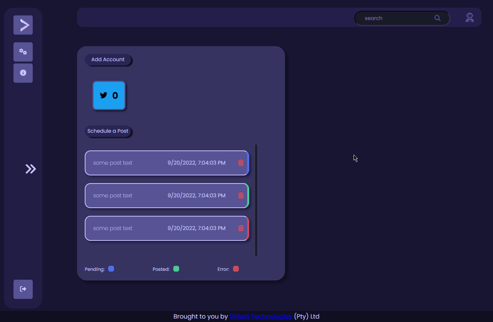

# OpenSMM


## Description
OpenSMM(Open Social Media Marketing) is a self-hosted social media marketing platform built to assist small businesses manage their social media more easily.



## :red_circle: Please Note:
- This project is in early development stages.
- Seek help on Discord(links at the bottom) for general support.
- All errors (should) print to Docker logs, if you encounter any that you can't fix(not config related) or something goes wrong but no errors are printed, open an issue.

### What Works
- Twitter text type scheduled posts
- Twitter poll type scheduled posts

## :large_blue_diamond: Installation
The application is built for Docker, we will have images on Docker Hub when the application is usable. Here's how to get it running for now:

Clone source:
```bash
git clone https://github.com/vaughngx4/OpenSMM.git
cd OpenSMM
```

Copy example .env file and make changes:
```bash
cp .env.example .env
$EDITOR .env
```

Copy mongo init script and make changes:
```bash
cp init-mongo-template.js data/mongo/init-mongo.js
$EDITOR data/mongo/init-mongo.js
```

Build/rebuild images and start containers:
```bash
./rebuild.sh
```

## :green_circle: Development
### ToDo
- [x] Authenticate Twitter API v2 OAuth2
- ~~Add scheduling interface and cron scheduling~~
- [x] Add scheduling support
- [x] Add poll support
- [ ] Add attachment support
- [x] Add validation to api
- [ ] Add validation to UI
- [x] Clean up UI and add popup responses
- ~~Store attached images for reuse~~
- [ ] Store attachments for reuse
- [ ] Add option to reschedule a post
- [ ] Add option to add time slots
- [ ] Add option to auto-schedule to next available time slot

### Front End Development VS Code Guide

1. Install "Live Server (Five Server)" on the Extensions Marketplace
2. Right click the "www" folder and select "Open with Five Server (root)"

#### Debugging

1. How to open the screen behind the "Schedule a Post" button.

1.1 Search for "debug !!!" in app.js and find these lines:
```
  const result = await getTwitterAccounts();
  const twitterAccounts = result.data;
  // const twitterAccounts = ["sintelli_tech", "mindglowingart"]; // debug !!!
```
1.2 Comment the first 2 lines and uncomment the last line like this:
```
  const result = await getTwitterAccounts();
  const twitterAccounts = result.data;
  // const twitterAccounts = ["sintelli_tech", "mindglowingart"]; // debug !!!
```
1.3 When pushing to development, please bring back to state 1.1


2. Show some example posts in the dashboard

2.1 Search for "debug !!!" in app.js and uncomment like this:
```
showPosts() // debug !!!
```
2.2 Put these 2 lines in comments like this:
```
  // const result = await getPosts();
  // const posts = result.data;
```
2.3 Uncomment the following like this:
```
  const date = new Date(); // debug !!!
  const posts = [ // debug !!!
    ...
  ];
```
2.4 When pushing to development, please reverse these actions


3. Show notification

3.1 Search for "debug !!!" in app.js and uncomment the following line like this:
```
popMsg() // debug !!!
```
3.2 Search for "debug !!!" in popup-message.js and comment/uncomment the following lines like this:
```
  timedDestruction(popup, 1500000); // debug !!!
  // timedDestruction(popup, 5000);
```
3.3 You can find the notification popup on the main dashboard
3.4 When pushing to development, please reverse these actions

## :coffee: Buy Us a Coffee
If you like what we're doing and want to see more, feel free to leave us a donation! Currently only accepting GitHub Sponsorships.

## :telephone_receiver: Contact Us
You can get a hold of us on Discord https://discord.gg/TSnvnjE6zP or Matrix(Discord bridged) https://matrix.to/#/!xaTiJIBHgIwTeVOVYt:sintelli-tech.com?via=sintelli-tech.com or send us a message https://sintelli-tech.com/contact